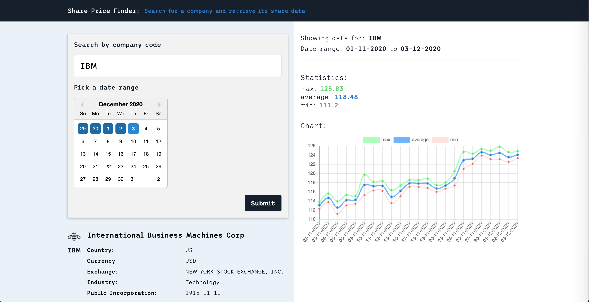

# Share Price Search
> A technical test. View at [martinbagshaw.github.io/Share-Price-Search](https://martinbagshaw.github.io/Share-Price-Search)

Develop a simple Single Page Application (SPA) that allows a user to
retrieve a weeks’ worth of historical share price data for a specified
company.

## Challenge
- Use the publicly available API at [Finn Hub](https://finnhub.io/docs/api#stock-candles)
- The SPA should display the selected date range, the company name
and the minimum, maximum and average share price over the selected
week.
- The weekly date range should be set through a date picker and default
to the last 7 days (inclusive of the current day).
- The user should be provided with a mechanism to enter/select a
company and retrieve its share data.
- The API contains other endpoints (e.g. News &amp; Basic Financials). You
may use these to add additional features to your application.

## User Story
- As a user running the system
- I can view basic stock information on a selected company
- So that I can make a decision on what stock to buy

## Instructions
- Spend as much or as little time on the exercise as you like.
- Use whatever UI frameworks / libraries / packages you like.
- Try to consider good development practices and think how it could be
extended (i.e. scalability / infrastructure best practice)
- Your code should compile and run in one step.
- All stories to be completed with an appropriate level of testing.
- We will review and consider ALL aspects of the code you submit including the
HTML mark-up and CSS.